<div align="center">

# ⚔️ XDRAGONSLAYER

**A small tale about a big lizard.**<br>
A tiny old-school action RPG in the spirit of Diablo and Ultima Online, with a Zelda-style boss cave. You start with a butter knife and finish as a Dragonslayer. The faster you do it, the better your rank.


<br>


<br><br>

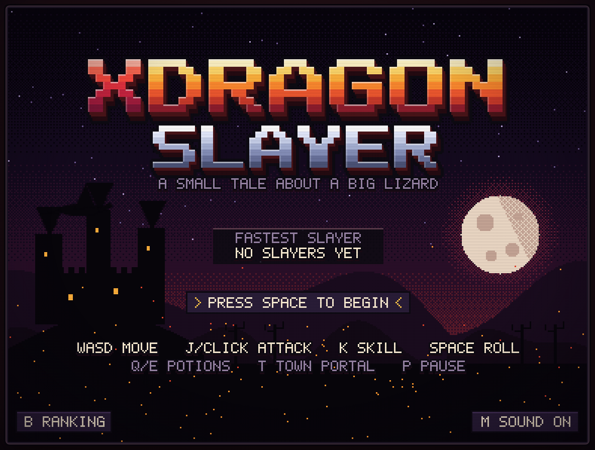
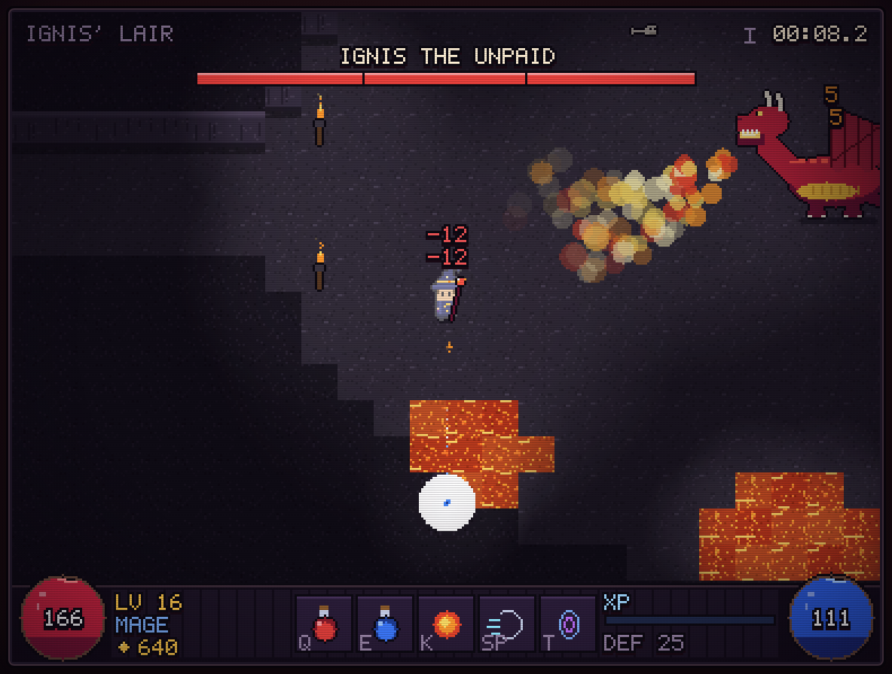

<sub>Left: the title screen. Right: Ignis the Unpaid breathing fire at a very worried mage.</sub>

</div>

---

## Contents

- [The story](#-the-story)
- [Features](#-features)
- [Play it](#-play-it)
- [How to play](#-how-to-play)
- [Classes](#-classes)
- [The kingdom: inn and smiths](#-the-kingdom-inn-and-smiths)
- [Gear and runes](#-gear-and-runes)
- [World and bestiary](#-world-and-bestiary)
- [Bosses](#-bosses)
- [Levels and XP](#-levels-and-xp)
- [Scoring and the leaderboard](#-scoring-and-the-leaderboard)
- [Gallery](#-gallery)
- [How it works](#-how-it-works)
- [Agent handoff](#-agent-handoff)

## 📜 The story

> In the Kingdom of Bumbleton, life was simple. There were goats. There were more goats. There was a king who counted the goats.
>
> Then a golem moved into the Old Cave, and the goats started going missing.
>
> The king needed a hero. A mighty champion. A living legend. **He found you instead.**

King Bumbleton IV hands you his grandmother's butter knife ("it has never lost a fight; it has never been in one, either") and sends you east. Your route runs through the Whispering Woods, across the Moaning Marsh and into the Old Cave to slay **Gravelbottom the Golem**.

The golem is not quite what the king thinks it is. Beneath the cave something much warmer is waking up.

## ✨ Features

- **One file, zero dependencies.** [`xdragonslayer.html`](xdragonslayer.html) is the whole game: no libraries, images or network requests, and no build step.
- **No fonts anywhere.** Every letter comes from hand-drawn 5×7 bitmaps, and the logo uses a chunky 7×7 face with banded color, extrusion and a shine sweep.
- **Fast, arcade action RPG.**
  - Aim with the mouse, or rely on auto-aim.
  - Dodge-roll with invincibility frames.
  - Land perfect dodges to earn guaranteed crits that chain up to **×3**.
- **3 classes, chosen at level 2:** Warrior, Ranger and Mage, each with its own attack and skill.
- **You look like your gear.** Rags become leather, then chain, then plate, then dragonscale. Capes appear at the top tiers, headgear changes (horned helms, hoods, wizard hats), and weapons grow and glow.
- **Arcade loot.** Rare, epic and legendary **runes** drop with Diablo-style light beams. Picking one up instantly upgrades your current weapon or armor with a random effect, and effects stack to level 5.
- **15 monster types, each with its own attack pattern**, plus a golem mini boss and a three-phase red dragon.
- **A cozy hub.**
  - An inn for a quick heal.
  - A weaponsmith and an armorsmith for tier upgrades and +10 enhancements.
  - A town portal home.
  - Goats. Many goats.
- **Mood.**
  - Zone chiptune tracks and synthesized sound effects.
  - Torch-lit cave darkness, glowing lava and marsh fog.
  - Damage numbers, screen shake, hit-stop and a proper **YOU DIED**.
- **Plays with a keyboard, a mouse, or touch** (virtual stick plus buttons).

## 🎮 Play it

```sh
# no build step — just open the file
start xdragonslayer.html     # Windows
open xdragonslayer.html      # macOS
```

Or serve the folder, for example with `python -m http.server`, and open `http://localhost:8000/xdragonslayer.html`.

## 🕹 How to play

### The goal

The route runs through five areas, and the clock starts when the king finishes talking:

**Kingdom** → **Whispering Woods** → **Moaning Marsh** → **The Old Cave** → **the golem** → **Ignis' Lair** → **the dragon** → ending.

A gold compass arrow at the screen edge always points to your next objective. **Your score is your total time.** Dialog, shops and deaths all count toward it; only the pause menu stops the clock.

### Controls

| Action | Keyboard / mouse | Touch |
|---|---|---|
| Move | `W` `A` `S` `D` or arrow keys | Drag on the left side (virtual stick) |
| Attack (hold to repeat) | `J` or **left-click**, aimed at the cursor | **ATK** button (auto-aims) |
| Class skill | `K` or **right-click** | Skill slot on the HUD |
| Dodge roll | `Space` or `Shift` | **ROLL** button |
| HP / MP potion | `Q` / `E` (or `1` / `2`) | Potion slots on the HUD |
| Town portal | `T` | Portal slot |
| Talk / shop | `J`, `F` or `Enter` near an NPC | Tap |
| Pause and character sheet | `P`, `Esc` or `Tab` | **II** button |
| Sound on / off | `M` | **SOUND** button on the title screen |

> **Aiming:** if you've moved the mouse in the last few seconds, attacks go toward the cursor. Otherwise they lock onto the nearest enemy in the direction you're facing, which makes keyboard-only and touch play comfortable.

### Core mechanics

| Mechanic | What it does |
|---|---|
| **Dodge roll** | A 0.3 s roll that starts fast (235 px/s) and slows down. You're **invincible from 0.02 s to 0.27 s**. The cooldown is 0.42 s, shown on the HUD's roll slot, and the **SWIFT** rune shortens it. |
| **Perfect dodge** | Roll *through* a hit that would have landed. You get **PERFECT!**, a brief slow-motion moment, and **3 seconds where every hit crits**. Chain perfects while that's active to raise the crit multiplier **×2 → ×2.5 → ×3**. Poison clouds and fire patches don't count. |
| **Crits** | Deal ×2 damage normally. Your base crit chance comes from your class, and **KEEN** runes add more. |
| **Telegraphs** | A red **!** over an enemy means an attack is coming. Red lines show charges and pounces, and filling circles show where something is about to land. A solid white ring means "now". |
| **HP potion** (`Q`) | Heals 45% of max HP and cures poison. 14 s cooldown. |
| **MP potion** (`E`) | Restores 60% of max MP. 10 s cooldown. **ALCHEMY** runes shorten both potion cooldowns. |
| **Globes** | Red globes (7% drop chance) heal 25% HP, and blue globes (5%) restore 35% MP. |
| **Town portal** (`T`) | Stand still for 1.1 s to warp home. A portal appears by the fountain, and stepping into it returns you to the exact spot you left. It doesn't work during boss fights. |
| **Terrain** | Bog water slows you. Spider webs slow you. Frog tongues pull you in. |
| **Death** | You lose 25% of your gold and wake up at the fountain. All monsters respawn, and a boss you haven't beaten resets. **The clock keeps running.** |

## 🧙 Classes

Everyone starts as a **Peasant** with Granny's Butter Knife: 6 damage, no skill ("You know no skills. Only panic."). **At level 2** the spirits make you pick a class. Your butter knife turns into that class's first weapon, and you keep its **+enhancements and runes**.

| | ⚔️ **Warrior** | 🏹 **Ranger** | 🔮 **Mage** |
|---|---|---|---|
| **Pitch** | "A sword. A shout." | "Pointy sticks, delivered from a safe distance." | "Read one book. Now throws magic bolts that pop." |
| **Attack** | A wide 143° sword arc with 31 px reach that hits everything in it | Fast arrows (340 px/s) | Magic bolts that burst in a 16 px splash |
| **Attack cooldown** | 0.42 s | 0.30 s | 0.46 s |
| **Skill** (`K`) | **WHIRLWIND** (12 MP): spin for 0.9 s, hitting everything within 40 px for 60% damage every 0.15 s | **VOLLEY** (10 MP): 7 arrows in a fan, each doing 80% damage and piercing one enemy | **FIREBALL** (14 MP): 250% damage in a 42 px blast that sets enemies on fire |
| **HP** (level 1 / per level) | 72 / +14 | 54 / +10 | 46 / +8 |
| **MP** (level 1 / per level) | 18 / +2 | 20 / +3 | 36 / +5 |
| **Base crit** | 6% | **14%** | 8% |
| **Innate armor** | +4 | +2 | +1 |
| **Mana regen** | 0.5 / s | 0.5 / s | **1.4 / s** |
| **Speed** | 86 | **96** | 88 |

Damage grows **+7% per level**. Each level-up also refills 35% of your HP and 50% of your MP.

## 🏰 The kingdom: inn and smiths

| NPC | Where | What they offer |
|---|---|---|
| 👑 **King Bumbleton IV** | Castle gate | The quest, hints and gentle royal confusion. |
| 🍺 **Greta the Innkeeper** | Inn, west side | **Rest** (5 G): full HP and MP, cures poison. **Rumor** (1 G): a gameplay tip, sometimes true. |
| 🔨 **Brok the Weaponsmith** | Blue roof | **Forge** your next weapon tier, and **Sharpen** it up to +10 (each +1 is +8% damage). |
| 🛡️ **Hilda the Armorsmith** | Green roof | **Forge** your next armor tier, and **Reinforce** it up to +10 (each +1 is +2 DEF). |

### Forge costs

| Tier | Weapon forge | Armor forge |
|:-:|:-:|:-:|
| 1 | 60 G, needs level 4 | 50 G, needs level 3 |
| 2 | 150 G, level 7 | 130 G, level 6 |
| 3 | 320 G, level 10 | 280 G, level 9 |
| 4 | 600 G, level 13 | 520 G, level 12 |

Sharpening costs `20 + 15 × current plus` gold and reinforcing costs `15 + 12 × current plus`, so the first +1 is 20 G and 15 G. You can't afford everything in one run, so choose.

## 🗡️ Gear and runes

### Weapons (base damage)

| Tier | Warrior | Ranger | Mage |
|:-:|---|---|---|
| 0 | Rusty Sword · 11 | Short Bow · 8 | Twig Wand · 10 |
| 1 | Iron Sword · 17 | Hunter Bow · 12 | Oak Staff · 15 |
| 2 | Knight Blade · 25 | Elven Longbow · 18 | Crystal Staff · 22 |
| 3 | Flame Brand · 35 | Storm Bow · 26 | Arcane Staff · 31 |
| 4 | **Dragonbane** · 50 | **Dragonbane Bow** · 37 | **Dragonbane Staff** · 44 |

### Armor (and how it changes your look)

| Tier | DEF | Warrior | Ranger | Mage |
|:-:|:-:|---|---|---|
| 0 | 0 | Peasant Rags + headband | Peasant Rags | Rags + humble wizard hat |
| 1 | 6 | Leather Jerkin | Leather Jerkin | Apprentice Robe (blue hat) |
| 2 | 14 | Chainmail + iron helm + pauldrons | Studded Leather + hood | Silk Robe (starred hat) |
| 3 | 24 | Knight Plate + plumed helm + red cape | Shadow Cloak + cape | Runed Robe, gold runes and cape |
| 4 | 38 | **Dragonscale Plate** + horned gold helm | **Dragonscale Mail** | **Dragonscale Robe** |

Damage you take is multiplied by `60 / (60 + DEF)`.

### Runes: upgrade your gear on the spot

Normal monsters drop a rune 2.8% of the time, and **champions** (marked with a gold ★) drop one 30% of the time. **Mimics always drop at least an epic rune**, and the **golem drops a legendary** one.

A rune lands on your **weapon or armor** at random, adds a random effect, and **stacks to level 5**.

| Rarity | Chance | Effect levels added |
|---|:-:|:-:|
| 🔵 Rare | 70% | +1 |
| 🟣 Epic | 25% | +2 |
| 🟠 Legendary | 5% | +3 |

<details>
<summary><b>All 14 rune effects (per level)</b></summary>

| Weapon effect | Per level | | Armor effect | Per level |
|---|---|---|---|---|
| 🔥 **BURN** | Sets enemies on fire for 30% of the hit's damage over 2.2 s | | 🌵 **THORNS** | Reflects 20% of damage taken back at the attacker |
| ❄️ **FROST** | 20% chance to chill (slows enemies 45% for 2 s) | | ❤️ **REGEN** | +0.8 HP per second |
| 🩸 **VAMPIRIC** | Heals you for 2% of the damage you deal | | 💪 **VIGOR** | +8% max HP |
| 🎯 **KEEN** | +4% crit chance | | 💨 **SWIFT** | +5% move speed and 8% shorter roll cooldown |
| ⚡ **FURY** | +8% attack speed | | 🔷 **ARCANE** | +0.6 MP per second |
| 🌩️ **THUNDER** | 10% chance to chain lightning to 3 more enemies for 50% damage | | 🧪 **ALCHEMY** | 8% shorter potion cooldowns |
| 💰 **GREED** | +15% gold | | 🛡️ **GUARD** | 5% chance to block a hit completely |

Your weapon glows in the color of its strongest effect. Your full rune list is on the pause screen.

</details>

## 🌲 World and bestiary

| Zone | Monster levels | The vibe | New dangers |
|---|:-:|---|---|
| 🏡 **Kingdom of Bumbleton** | — | "Population: mostly goats" | None. Pet the goats. |
| 🌳 **Whispering Woods** | 1–5 | "The trees gossip about you" | A gentle start: the first packs are just slimes |
| 🪦 **Moaning Marsh** | 5–10 | "Please stop moaning" | Fog, lanterns, bog water that slows you, tombstones everywhere |
| 🕯️ **The Old Cave** | 10–15 | "No refunds" | Darkness and torchlight, crystal glow, suspicious treasure chests |
| 🌋 **Ignis' Lair** | Boss | "It is very warm in here" | Lava. A dragon. |

The layouts are **generated from fixed seeds**, so every run gets the same world, which keeps speedruns fair.

Monsters gain +30% HP and +22% damage per level. A pack leader has a 12% chance to be a **champion** (14% in the cave): ★ gold, with 2.2× HP, 1.4× damage, 3× XP and gold, and a 30% rune chance.

<details>
<summary><b>The bestiary: all 15 monsters and how to beat them</b></summary>

| # | Monster | Zone | Attack pattern | Tip |
|:-:|---|---|---|---|
| 1 | 🟢 **Slime** | Woods | Hops toward you, squishes for 0.45 s, then leap-slams where you're headed | Roll away when it squishes |
| 2 | 👺 **Goblin** | Woods | Runs up, raises its knife (**!**), then dash-stabs along a red line | Sidestep the line |
| 3 | 🍄 **Sporeling** | Woods | Swells up, then puffs out a poison spore cloud about 32 px wide | Back off; poison can't kill you, but it adds up |
| 4 | 🐺 **Dire Puppy** | Woods | Circles you, crouches, then pounces | It's fast. Roll through the pounce for a perfect |
| 5 | 🏹 **Goblin Archer** | Woods | Keeps its distance, aims along a dotted line, fires where you're going | Change direction after the aim line appears |
| 6 | 💀 **Skeleton** | Marsh | A three-swing combo; the third hits harder and reaches further. It **gets back up once** at 50% HP | Hit the bones, or use BURN, to keep it down |
| 7 | 🧟 **Zombie Peasant** | Marsh | Slow and tanky, hurts on contact, groans ("GRAAAINS?"), then lurches at you | Don't let it corner you |
| 8 | 👻 **Wailing Wisp** | Marsh | Flies over walls, fades out, reappears nearby and fires a slow homing orb | You can't hit it while it's faded. Wait |
| 9 | 🐸 **Bog Frog** | Marsh | Hops closer, puffs its throat, then lashes a 98 px tongue that **pulls you in** ("SLURP!") | Step off the pink line |
| 10 | 🔮 **Hexer** | Marsh | Keeps away and drops **three hex circles** around you. Blinks away if you get close | Keep moving; the circles take 1 s to go off |
| 11 | 🦇 **Cave Bat** | Cave | Swarms of four flutter around you, screech, then dive-bomb | Stay mobile. A warrior's Whirlwind or a Volley clears them |
| 12 | 💣 **Kobold Bomber** | Cave | Keeps away and lobs bombs: a landing circle, then a 0.9 s fuse ("FIRE IN THE HOLE") | Walk out of the circle |
| 13 | 🕷️ **Giant Spider** | Cave | Spits web that slows you and leaves a sticky patch, then charges when you're close | Roll clear of the webs |
| 14 | 📦 **Mimic** | Cave | Looks exactly like a treasure chest. "SURPRISE!" Three bite-hops, then it rests with its mouth open | Hit it while it rests (×1.5 damage). **It drops epic+ runes and 6× gold** |
| 15 | 🛡️ **Dark Knight** | Cave | Its **shield blocks 80%** from the front. Up close it winds up a ground slam with a shockwave; from range it charges | Hit it from behind or right after the slam, when its shield is down |

</details>

## 🐉 Bosses

<table>
<tr>
<td width="50%" valign="top">

### 🪨 Gravelbottom the Golem
*Mini boss · 3000 HP · The Old Cave*

Enter its arena and the exits seal.
- **Slam:** a 0.85 s wind-up, then a 50 px impact and a 160 px shockwave ring. Afterwards it's **STUCK** for 1.2 s and takes **×1.5 damage**.
- **Boulder toss:** 3 lobbed boulders with landing circles (4 when furious).
- **Roll charge:** curls up and rolls along a red line, bouncing off the walls, then gets **DIZZY** (vulnerable).
- **Below 50%, FURIOUS:** 25% faster, double shockwaves, and **rock rain** (9 falling rocks) plus 3 Pebble minions.

</td>
<td width="50%" valign="top">

### 🔥 Ignis the Unpaid
*Final boss · 7500 HP · Ignis' Lair*

"I have not been paid in four hundred years."
- **Phase 1 (above 66%):** a sweeping **fire breath** cone, 3-shot **fireball volleys**, and a **tail swipe** when you get close.
- **Phase 2 (66–33%):** takes flight and is **out of reach**. Rains 8 **meteors**, then **dive-slams** your position with a shockwave and lies **STUNNED** for 1.7 s.
- **Phase 3 (below 33%):** **enraged** and 30% faster, with twin **fire nova rings** (roll through them), 12 meteors, 6-shot volleys and a wider breath.

</td>
</tr>
</table>

<p align="center">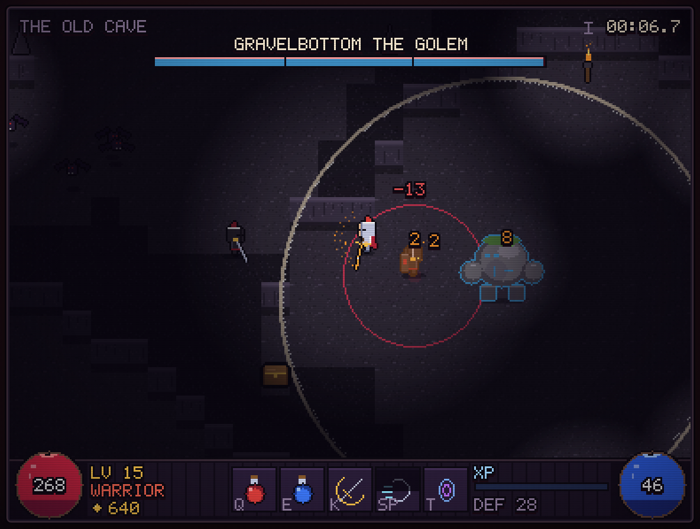 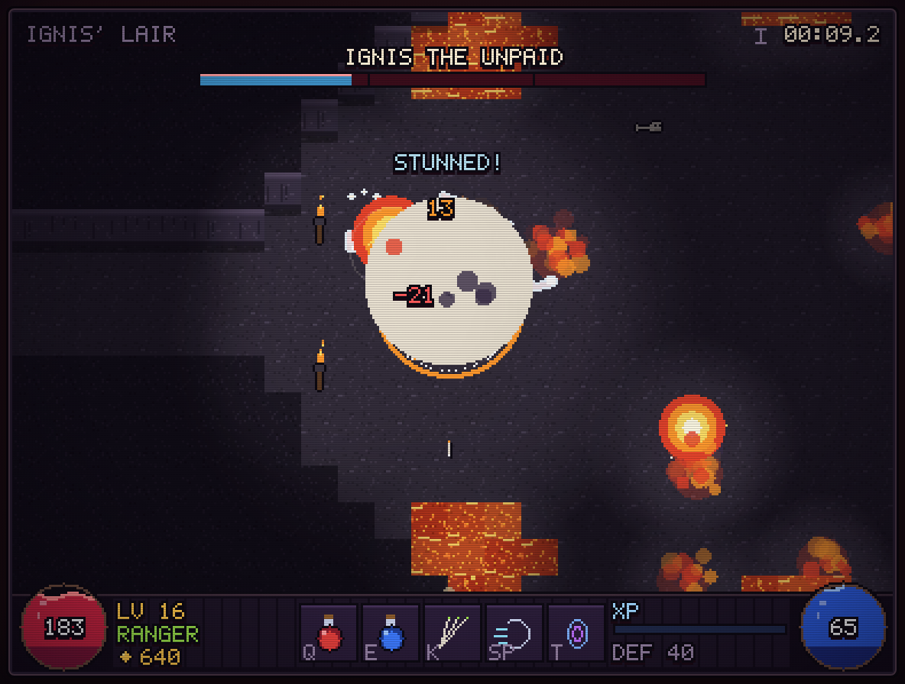</p>

## 📈 Levels and XP

The max level is **20**. Each level needs `round(15 + 10 × level^1.6)` XP. A kill is worth `(5 + 4 × monster level)` XP, ×3 for champions and ×2 for mimics, and each boss gives 650.

| Level | 1→2 | 2→3 | 4→5 | 6→7 | 9→10 | 12→13 | 14→15 | 16→17 | 19→20 |
|---|:-:|:-:|:-:|:-:|:-:|:-:|:-:|:-:|:-:|
| XP needed | 25 | 45 | 107 | 191 | 351 | 548 | 697 | 859 | 1127 |
| XP total | 25 | 70 | 250 | 587 | 1472 | 2912 | 4230 | 5866 | 8974 |

The monster totals were tuned so a normal run finishes the **woods around level 5–6**, the **marsh around 10–11**, and reaches the **golem around 14–15**. Level 20 is for grinders and completionists. *(These are estimates from the formulas, not playtested yet.)*

## 🏆 Scoring and the leaderboard

Your **score is your final time**, from the moment the king stops talking until the dragon falls.

| Rank | Time | Title |
|:-:|:-:|---|
| **S** | under 10:00 | Legendary Slayer |
| **A** | under 13:00 | Dragonslayer |
| **B** | under 17:00 | Dragon Botherer |
| **C** | under 22:00 | Dragon Annoyer |
| **D** | 22:00+ | Professional Goat Herder |

The **Fastest Slayers** board keeps the top 10 times on your device, entered with arcade-style initials. The fastest one also appears on the title screen. It's stored in `localStorage` under `xds.board.v1`, with your last-used name in `xds.name.v1`.

## 🖼 Gallery

<table>
<tr>
<td width="50%">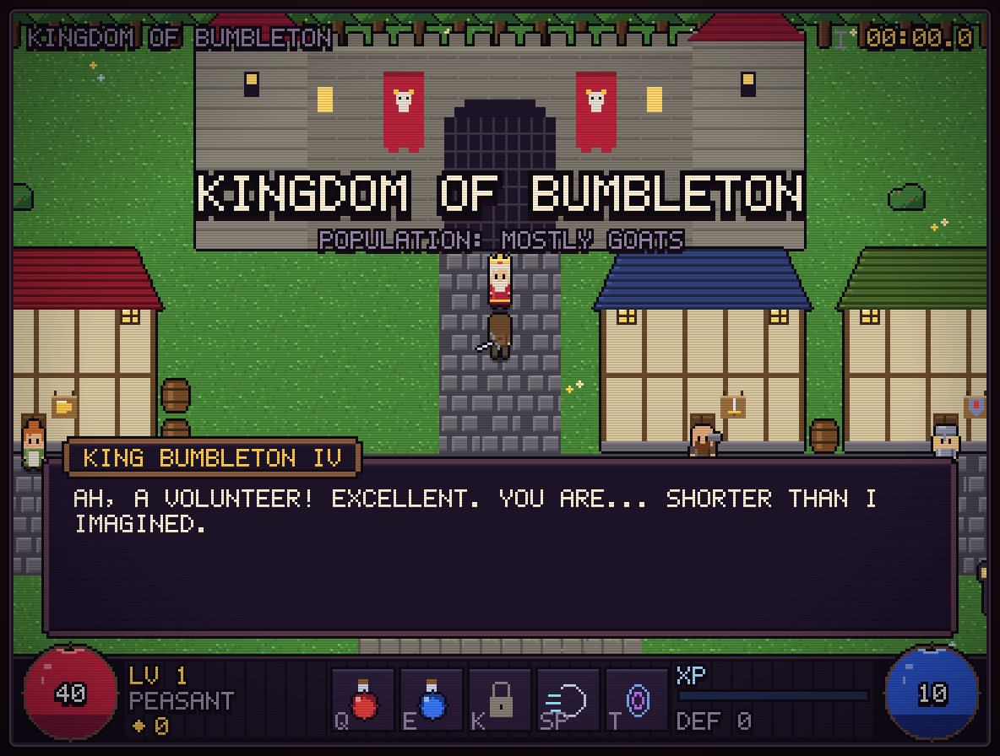<br><sub><b>The Kingdom</b>: the king explains your job. You are shorter than he imagined.</sub></td>
<td width="50%">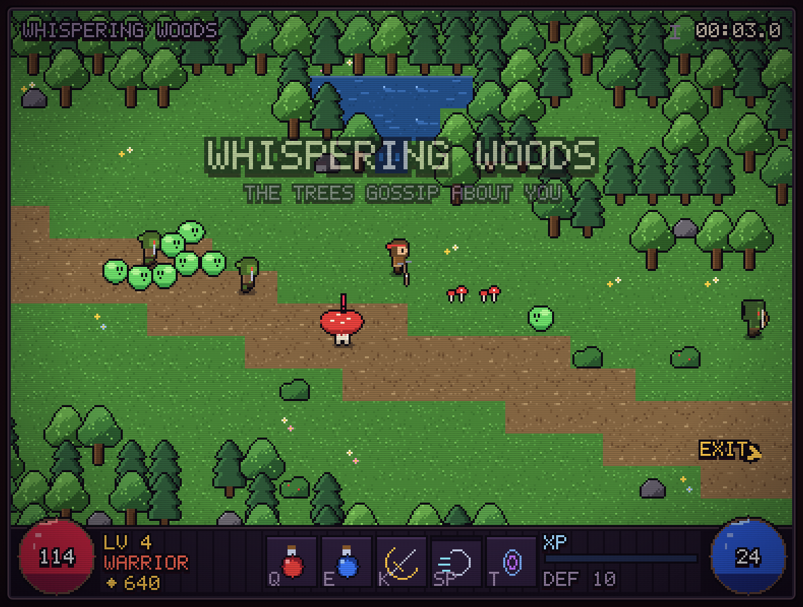<br><sub><b>Whispering Woods</b>: slimes, goblins and a Sporeling about to puff.</sub></td>
</tr>
<tr>
<td>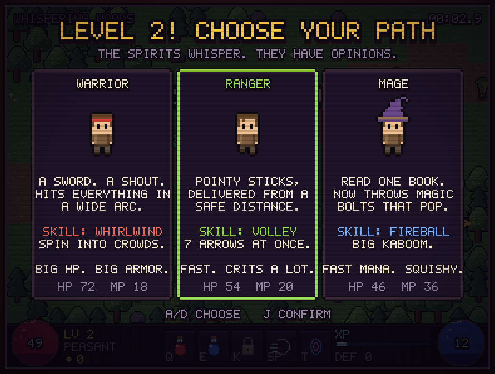<br><sub><b>Level 2</b>: pick your path. The spirits have opinions.</sub></td>
<td>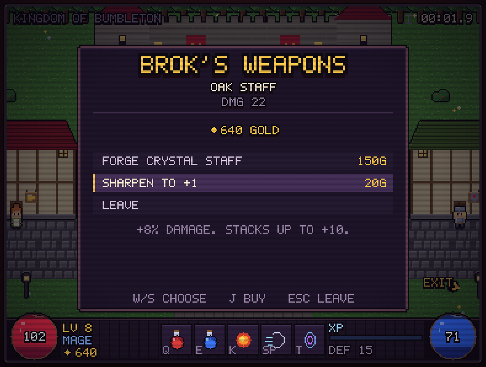<br><sub><b>Brok's Weapons</b>: pointy end goes in the monster.</sub></td>
</tr>
<tr>
<td>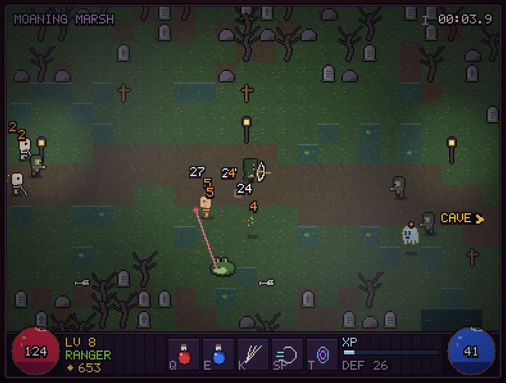<br><sub><b>Moaning Marsh</b>: zombies, wisps, and a frog tongue mid-SLURP.</sub></td>
<td>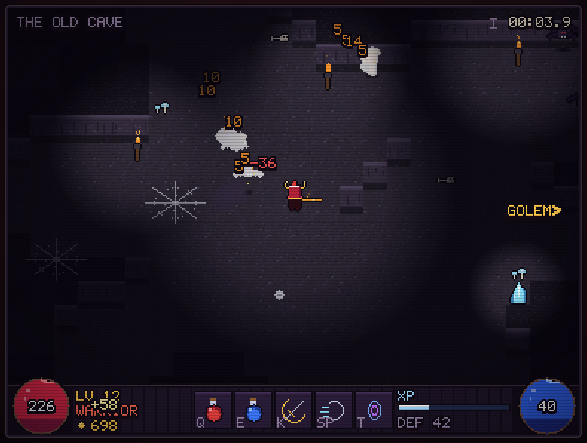<br><sub><b>The Old Cave</b>: spiders, webs, bats and very little light.</sub></td>
</tr>
<tr>
<td>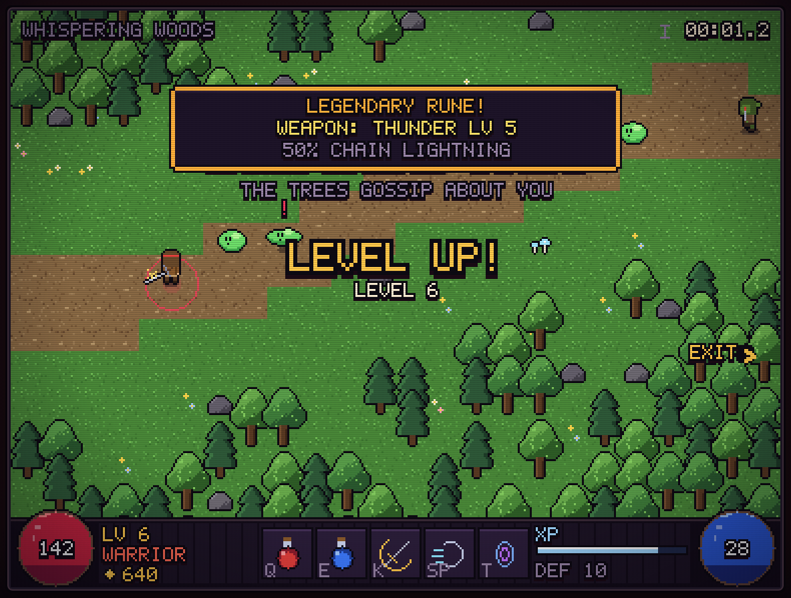<br><sub><b>Loot</b>: a legendary THUNDER rune, and a level-up.</sub></td>
<td>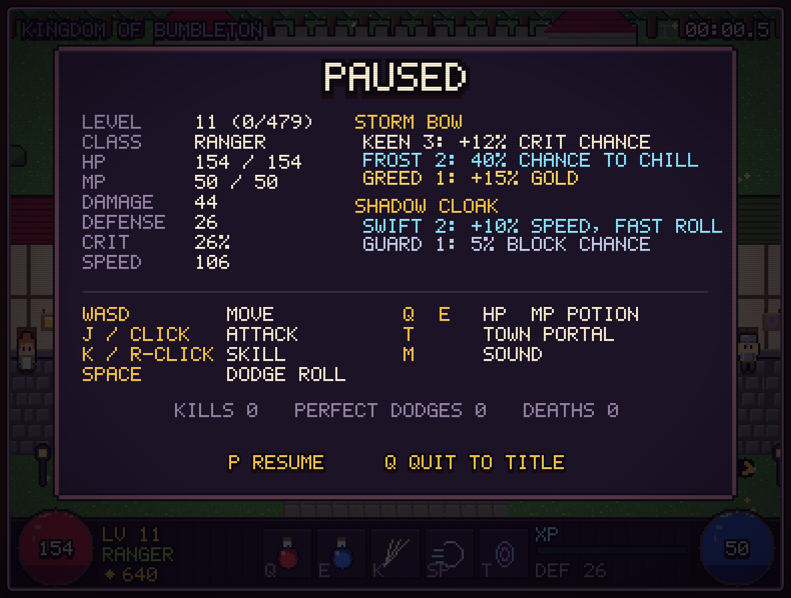<br><sub><b>Pause</b>: your character sheet, gear and every rune effect.</sub></td>
</tr>
<tr>
<td>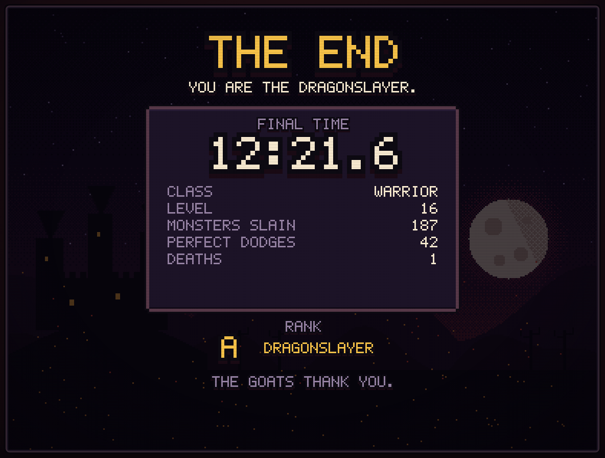<br><sub><b>The end</b>: final time and rank. The goats thank you.</sub></td>
<td>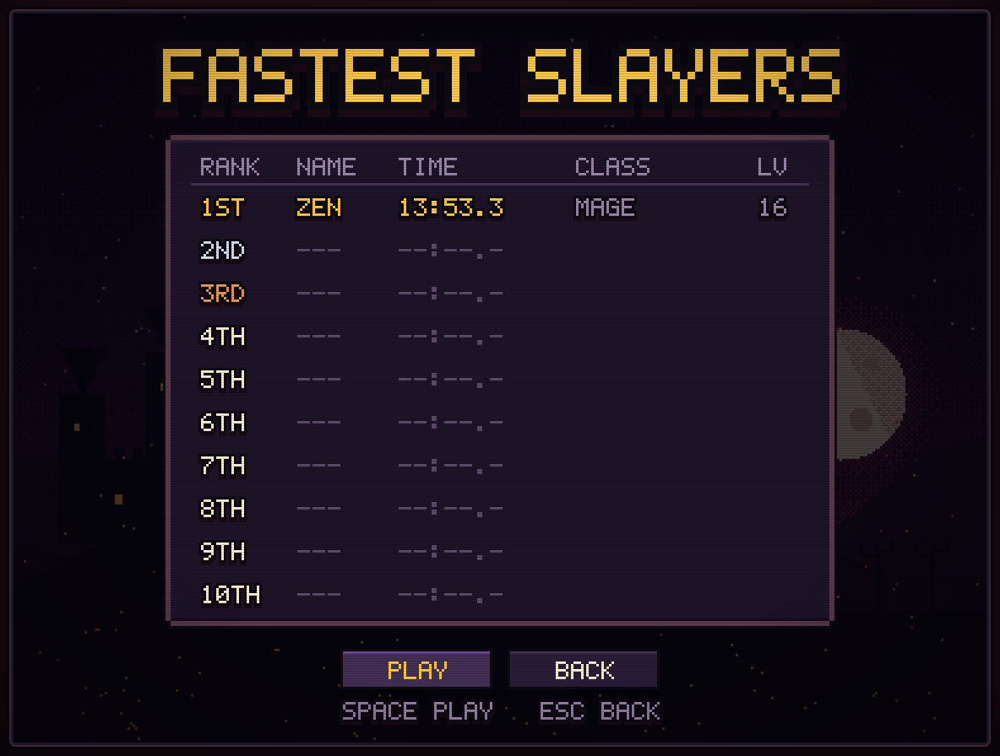<br><sub><b>Fastest Slayers</b>: the top-10 board.</sub></td>
</tr>
</table>

## 🔧 How it works

Everything is drawn on a **384 × 288** canvas and scaled up with CSS: whole-number scaling on desktop for crisp pixels, fractional scaling on touch devices. Tiles are 16 px. Each map is pre-rendered once into an offscreen canvas, and each frame copies the visible part, then draws objects and characters sorted by their y position on top.

### Screen flow

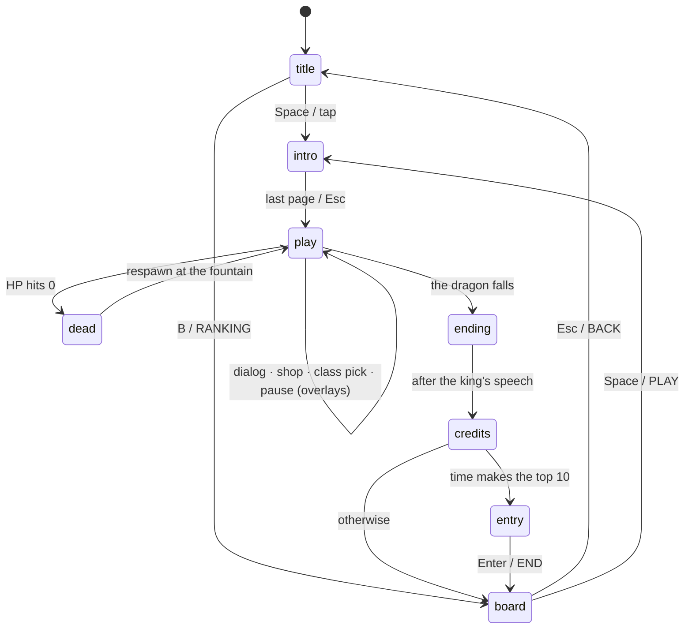
```mermaid
stateDiagram-v2
    [*] --> title
    title --> intro: Space / tap
    title --> board: B / RANKING
    board --> title: Esc / BACK
    board --> intro: Space / PLAY
    intro --> play: last page / Esc
    play --> play: dialog · shop · class pick · pause (overlays)
    play --> dead: HP hits 0
    dead --> play: respawn at the fountain
    play --> ending: the dragon falls
    ending --> credits: after the king's speech
    credits --> entry: time makes the top 10
    credits --> board: otherwise
    entry --> board: Enter / END
```

### Code map of `xdragonslayer.html`

The script is one IIFE, split into sections that each start with a `/* ===== name ===== */` banner. Search for a banner to jump to that section.

| Section | What lives there |
|---|---|
| `core` | Canvas size `W×H`, palette `P`, math helpers, seeded RNG `srand`, `disc` / `ell` / `line` / `ringPts`, dithering |
| `pixel font` | `F5` glyph bitmaps, `putText()` (cached and outlined), `wrap()` |
| `title logo` | `L7` chunky glyphs, `buildLogo()`, the shine sweep |
| `chiptune sfx + music` | `tone()` / `hiss()` synth, `SFX.*`, the `SONGS` note sequences and `musicTick()` |
| `input` | Keys held and pressed this frame, mouse aim, the touch stick and buttons, `inputVec()` |
| `data` | `CLS`, `WPN`, `ARM`, the forge tables, `AFF` rune effects, `RARITY`, the `MON` monster table, `ZONES`, `recalc()` |
| `tiles` / `world object sprites` | Procedural 16 px tile art, and outlined sprites for trees, tombs, crystals, houses and the castle |
| `maps` | Map builders: `genVillage()`, `genPath()` for the woods and marsh, `genCave()` (cellular cave with the arena), `genLair()`, `buildWorld()` exits, `openRubble()` |
| `sprite buffers` / `chibi humanoid renderer` | Auto-outlined sprite blits, the shared `hum()` body renderer, `HEADS` headgear, `heroLook()` gear visuals |
| `monster art` | `ART[type]` drawers, including the golem and the dragon |
| `entities & monster AI` | `makeMon`, `spawnEnts`, a shared wind-up / dash / leap / cast / rest state machine, `AI[type]` behaviors |
| `boss:` / `final boss:` | `AI.golem` + `golemPick`, `AI.dragon` + `dragonPick` |
| `combat` / `hero:` sections | `damageMon` (crits, block, rune effects), `killMon` (XP, gold, drops), `hurtHero`, `perfectDodge`, `gainXP`, attacks and skills |
| `hero update` | Movement, roll, aim, interaction, portal, exits, arena clamps |
| `projectiles, hazards, drops` | Projectile collisions; hazards (landing circles, shockwave rings, clouds, fire, webs); loot magnets |
| `world update, map changes, bosses` | The monster update pass and separation, `enterMap`, `changeMap` fades, boss start and finish |
| `world rendering` | `drawWorld()` (y-sorted), weapons, telegraphs, loot beams, particles, darkness and lights, fog, the compass |
| `HUD` / `modals` | Orbs, slots, banners, rune cards; dialog, shops, class pick, pause sheet |
| `game state` / `leaderboard` / screens | `G`, `newGame`, the ending, the board plus name entry, title, intro, death and credits |
| `update / render / loop` | The state machine, `render()`, `fit()`, the main loop |

<details>
<summary><b>Tuning knobs</b></summary>

| Knob | Where | Effect |
|---|---|---|
| `CLS` | data | Class HP and MP growth, speed, crit, attack rate, skill cost |
| `WPN`, `ARM`, `ARMDEF` | data | Weapon damage and armor DEF per tier |
| `FORGE_W`, `FORGE_A`, `sharpenCost`, `reinforceCost` | data | The shop economy |
| `MON` | data | Base monster HP, damage, speed and size, including boss HP |
| `ZONES[*].lv`, `ZONES[*].roster` | data | Monster levels and types per zone |
| `xpNeed` | data | The XP curve |
| `WOODS`, `MARSH` style objects | maps | Forest density, ponds, band width, decor mix |
| `AI[type]` wind-up times, cooldowns and speeds | entities & AI | How fair each telegraph feels |
| `heroIframes()`, `startRoll()`, `S.rollcd` | AI / hero | The roll's timing and invincibility window |
| `perfectDodge()` | hero | Focus length (3 s) and crit chain values |
| `rollRune()`, the drop chance in `killMon()` | combat | Rune rarity split and how often runes drop |
| `rankFor()` | game state | Speedrun rank thresholds |

</details>

## 🤝 Agent handoff

> Context for the next person or agent picking this up.

### Status

| | Item |
|:-:|---|
| ✅ | The full game loop is built: title, intro, village hub, 3 zones, mini boss, final boss, ending, credits, leaderboard |
| ✅ | The systems are built: classes, gear tiers and visuals, runes, shops, potions, portal, death, pause sheet, touch controls |
| ✅ | 16 scripted headless scenarios covered every screen, zone and boss phase, with **no runtime errors** |
| ⚠️ | **No person has played a full run yet.** The 10–20 minute length, difficulty curve, gold economy and boss HP are **estimates** |
| ⏳ | Not a git repo yet. An iOS wrapper could reuse the one from the sibling Xdodge project, which uses the same bridge conventions |

### House rules

- **Keep it one self-contained file.** No libraries, CDNs, image files or web fonts.
- **Never use a font.** All text goes through `putText()` and `F5`.
- Match the dense style: compact lines, few comments, descriptive names.
- Draw on whole pixels at 384×288, and take colors from `P` rather than new hex literals.

### Gotchas

1. **Only glyphs defined in `F5` render.** That's `A–Z 0–9 : ! . - / + ? > < * , ' " ( ) % = & _ ~` and space. Lowercase is shown as uppercase, and anything else is **silently dropped**.
2. **Enemy hits go through `tryHit(atk, dmg, src)`.** Each attack creates a single `newAtk()`, so it can hit once *or* trigger one perfect dodge. Reuse one `atk` across an attack's frames, and create a fresh one per swing or tick.
3. **Only the `play` state can hurt the hero** (`tryHit` checks `G.state`).
4. **To add a monster**, touch five places: `MON`, `ART`, `AI`, a zone `roster`, and `DEATHCOL`. Most AIs are a few lines on top of `monGeneric()` using `startDash`, `startLeap` or `startCast`.
5. **`buildWorld()` replaces `MAPS`.** Anything that holds a reference to it, including test hooks, must read it again afterwards.
6. **Map seeds are fixed** (village 101, woods 202, marsh 303, cave 777), so every run gets the same world. Changing a seed changes where packs, alcoves and mimics end up.
7. **The run timer** adds up real time in `play` and `dead`, and only the pause modal stops it. `dragonSlain()` freezes it into `G.finalTime`.
8. **Headless testing:** headless Chrome/Edge doesn't advance the animation-frame loop, so replace `requestAnimationFrame` with a 16 ms timer and use `--virtual-time-budget`. The screenshots in this README came from a scratch copy that exposes internals:
   ```sh
   # add a debug hook after the boot line (scratch copy only — never commit this)
   sed 's#^fit();toTitle();requestAnimationFrame(loop);$#&window.__dbg={G,hero,enterMap,newGame,gainXP,openShop,startEnding,recalc,dropItem,get MAPS(){return MAPS},get ents(){return ents}};#' xdragonslayer.html > scratch.html
   ```
   Then inject a `<script>` right after `<head>` that swaps `requestAnimationFrame` for `setTimeout(cb,16)` and calls things like `__dbg.enterMap('lair', 208, 216)`. Screenshot it with `msedge --headless=new --window-size=1184,896 --virtual-time-budget=8000 --screenshot=out.png scratch.html`.

### Suggested next steps

1. **Playtest a full run** for each class. Tune `MON` HP and damage, the forge prices and `xpNeed` until a first run lands at 15–20 minutes and an expert run under 10.
2. Put it in its own git repo, optionally with **GitHub Pages**.
3. Add an **iOS wrapper** by porting the Xdodge `ios/` project (XcodeGen, WKWebView, Game Center with a **fewest-seconds** leaderboard).
4. Ideas:
   - an on-screen pause button in the HUD for desktop mouse players;
   - Gamepad API support;
   - a New Game+ or hard mode;
   - more rune effects;
   - a secret goat ending.

---

<div align="center">
<sub>Made by <b>Jimmy Park</b> (<a href="https://github.com/eisenjimmy">@eisenjimmy</a>), with Claude Code. No goats were harmed. Several were hidden.</sub>
</div>
